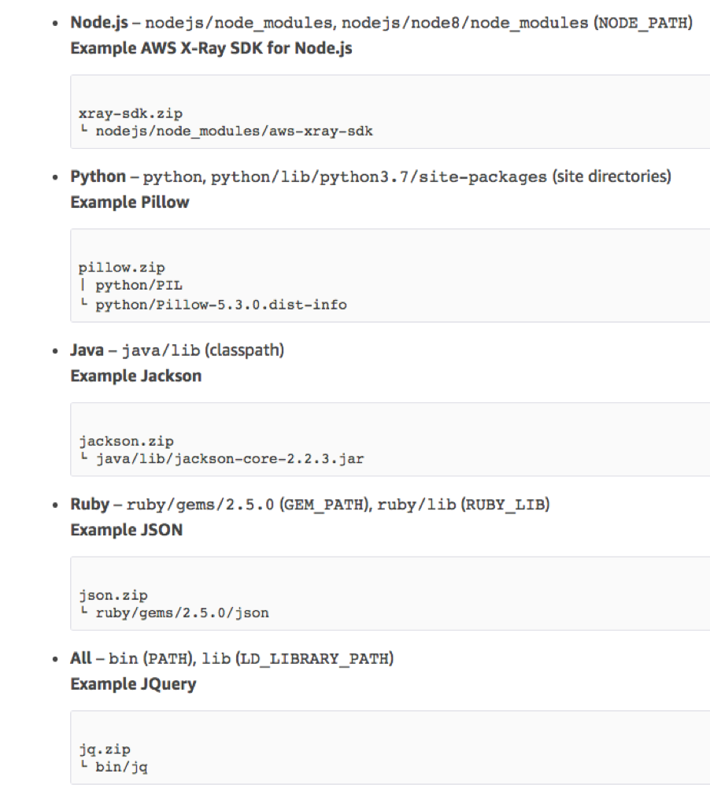
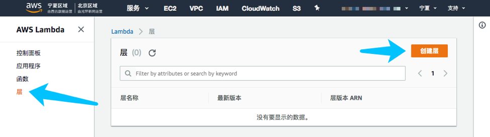
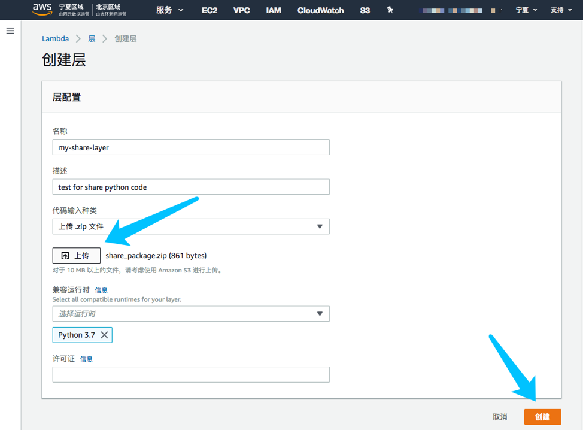
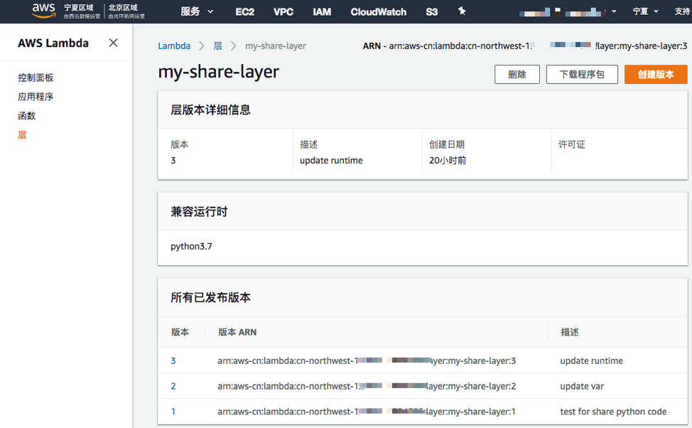
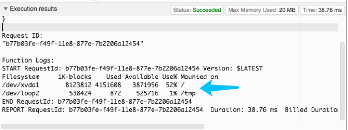
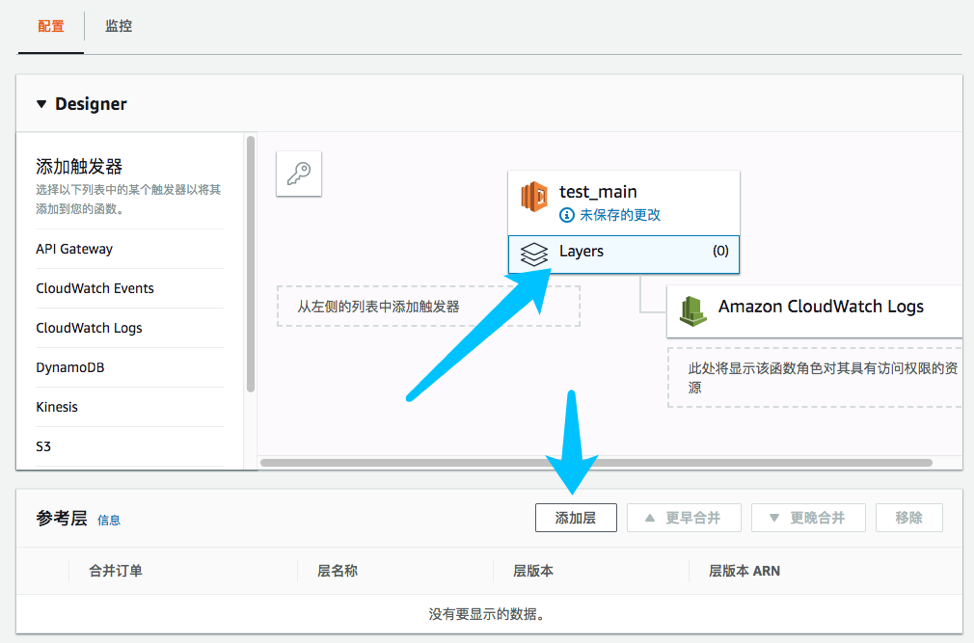
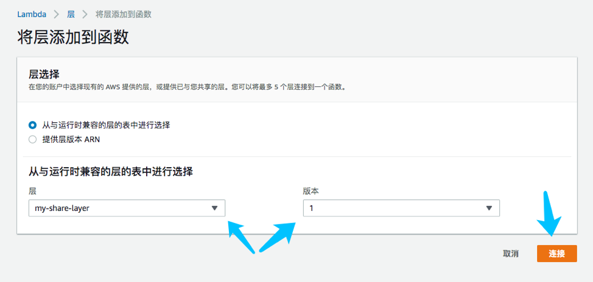
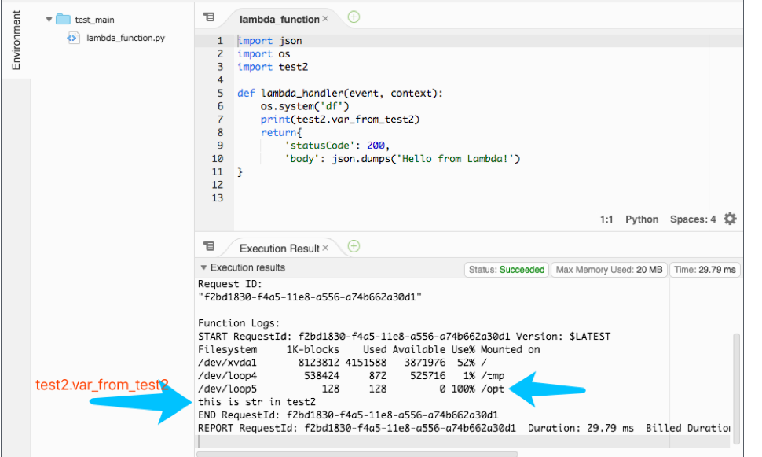
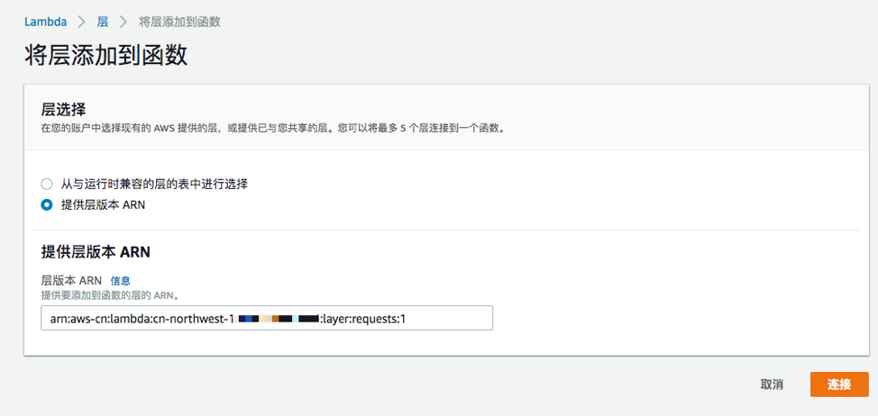
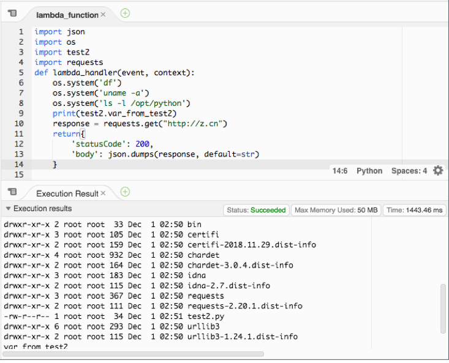

# lambda-layer-demo

使用AWS Lambda 的“层(Layer)”功能实现依赖包管理

AWS Lambda 是非常受开发者欢迎的无服务器运行代码的服务，现已原生支持各种主流开发语言，包括Python/Node.js/Go/Java/Ruby/.NET(PowerShell)，还支持自定义运行时，使得运行C++/Rust/Php/Shell等都成为可能。

我们在开发Lambda应用的时候，通常会有多个Lambda函数都共用的代码以及依赖的第三方包。Lambda 函数要调用这些依赖包，原来的做法是在每个Lambda函数打包的时候，连带依赖包一起打包。每个函数都这么做是不方便，也影响速度的。或者可以多个Lambda函数连同所有依赖包打包成一个大的包，但这样也不好管理。

现在AWS Lambda 新增了“层(Layer)” 功能使得可以单独上传并集中管理 Lambda 的依赖包了，这样Lambda函数打包的时候就只需要打包该函数本身的代码，依赖包只需要引用即可。这样的好处是显而易见的：
*	开发者不用再关注依赖包，而可以更专注于业务逻辑的开发
*	使得函数代码变小了，加快了部署的速度
*	可以跨AWS账户共享代码和依赖包，可以通过Policy控制只共享给某个账户，或者共享给所有账户都能分享你的代码成果。
这样多个账户的开发团队共享依赖包也可以轻松实现了。这真让人兴奋！

该功能在全球提供Lambda服务的AWS 区域，包括由西云数据运营的AWS中国（宁夏）区域和由光环新网运营AWS中国（北京）区域均已支持。以下就以Python引用本账户下的共享代码，以及引用另一账户分享的requests包两个例子，具体介绍一下层功能的使用方法。

##引用本账户的共享代码

1. 打包
先把要共享代码保存在本地电脑的python目录下，本例文件名为test2.py，因为是示例，我们的代码只写了如下一行：

	var_from_test2 = 'this is str in test2'

然后把该test2.py文件zip成share_package.zip，打zip包时文件名可以根据你的习惯来命名，但要注意目录结构，python的要放在python目录下，然后对python目录进行zip。所以新建一个python目录，打包后的目录结构是这样的：
	share_package.zip
	 python/test2.py

Lambda运行的时候会把依赖包放在运行环境的/opt目录下，并依据不同运行环境的下级目录来引用，所以需要严格按照如下图所示的目录结构打包：

2. 创建层(Layer)
到AWS Lambda控制台的“层”菜单，创建一个新的层

输入层 名称、描述，选择刚才打包的zip文件上传，并选择运行时。然后点“创建”

这样层就创建 成功了。以后如果要更新，则点“创建版本”进行更新。
    注意：
    层版本是不可修改的，如果一个版本被删除，或者层版本共享权限被取消了，已经引用了该版本的Lambda函数依然是能工作的，但不能再新建Lambda函数去引用这个被删除的层版本。

3. 创建函数(Function)
到“函数”菜单下创建Lambda的主函数test_main，上传代码，并配置对应的执行角色(例如lambda_base_execution)以及其他参数，这时候还没引入依赖包。先写一段简单代码，看看运行结果：

    import json
    import os

    def lambda_handler(event, context):
        os.system('df')
        
        return {
            'statusCode': 200,
            'body': json.dumps('Hello from Lambda!')
    }

保存并测试执行，这时候看到执行了Linux shell的df命令，列出了Lambda运行环境的本地目录，除了根盘，只有一个512MB 的 /tmp（这是可以供客户写入的临时盘）

4. 引入依赖
下面来引入依赖包test2，主函数test_main代码变成：

    import json
    import os
    import test2

    def lambda_handler(event, context):
        os.system('df')
        print(test2.var_from_test2)
        return{
            'statusCode': 200,
            'body': json.dumps('Hello from Lambda!')
    }

这里import了test2并且调用了其中的var_from_test2。
然后点Layers选项去连接层

添加层，选择刚才创建的层，并选择对应的层版本，然后“连接”

最后记得保存Lambda函数。这样就完成了依赖包的配置引用了。
注意：
每个Lambda函数最多可以配置5个层，函数加上层的总大小不能超过 250 MB （unzipped size） 。详见AWS Lambda Limits https://docs.aws.amazon.com/lambda/latest/dg/limits.html

5. 测试
测试执行，我们发现test2包的var_from_test2已经被主函数所调用。
并且我们看到Linux shell执行df的结果，Lambda环境多了一个/opt目录，这个就是保存依赖包的目录。

引用其他AWS账户的包
1. 本地安装requests包并上传到另一个AWS账户（以下称源账户）
在本地刚才已创建的python目录下，安装requests包到本目录：
	pip install requests -t .
	zip -r9 python-requests.zip ../python
然后在源账户的Lambda控制台，创建层，并上传python-requests.zip，层名称定为requests-layer，版本为1。记录下层版本的ARN，下面会用到。

2. 在源账户设置层共享
使用AWS CLI命令行设置层共享权限，如果CLI没有add-layer-version-permission命令，则请升级CLI到最新版本

    $ aws lambda add-layer-version-permission --layer-name requests-layer \
    --statement-id engineering-org --version-number 1 --principal '*' \
    --action lambda:GetLayerVersion
	
对所有AWS账户都分享该包，可以设置principal 为 '*'，如果只针对某个账户分享则设置对应的信任实体。
    --principal '<账户>' 等同于 --principal 'arn:aws-cn:iam:: <账户>:root' 。把<账户>替换为目的账户的号码
    --statement-id 是自定义的对该条策略的编号，如要对多个账户分享权限，可以多次下发该add-layer-version-permission命令，配置不同的帐号和statement-id。
用get-layer-version-policy命令查询设置的权限策略
    $ aws lambda get-layer-version-policy --layer-name requests-layer \
    --version-number 1

3. 在目的账户设置Lambda的GetLayerVersion权限
到要调用共享依赖包的那个账户（目的账户）在IAM控制台为Lambda的执行角色增加一个内联策略，赋GetLayerVersion的权限，使得Lambda可以获取其他账户的层
    {
        "Version": "2012-10-17",
        "Statement": [
            {
                "Sid": "VisualEditor0",
                "Effect": "Allow",
                "Action": "lambda:GetLayerVersion",
                "Resource": "*"
            }
        ]
    }

考虑最小权限原则，在生产环境里Resource应该用源帐号层版本的ARN来代替*

4. Lambda函数连接层
到目的账户的Lambda函数菜单，选择对应的函数，并添加层到当前函数。

选择提供层ARN，然后粘贴我们刚才在源账户创建的层ARN。这样就完成了调用第三方账户共享依赖包的工作了。

5. 测试
测试执行，Lambda已经可以import requests，并发起访问。
检查看到/opt/python目录已经有了刚才打包的所有依赖。

参考文档：
•	Lambda 层说明
https://docs.aws.amazon.com/lambda/latest/dg/configuration-layers.html
•	Lambda 运行环境和内置的库：
https://docs.aws.amazon.com/lambda/latest/dg/current-supported-versions.html
•	Lambda的IAM Policy
https://docs.aws.amazon.com/lambda/latest/dg/access-control-identity-based.html
•	IAM Policy说明
https://docs.aws.amazon.com/AmazonS3/latest/dev/s3-bucket-user-policy-specifying-principal-intro.html

